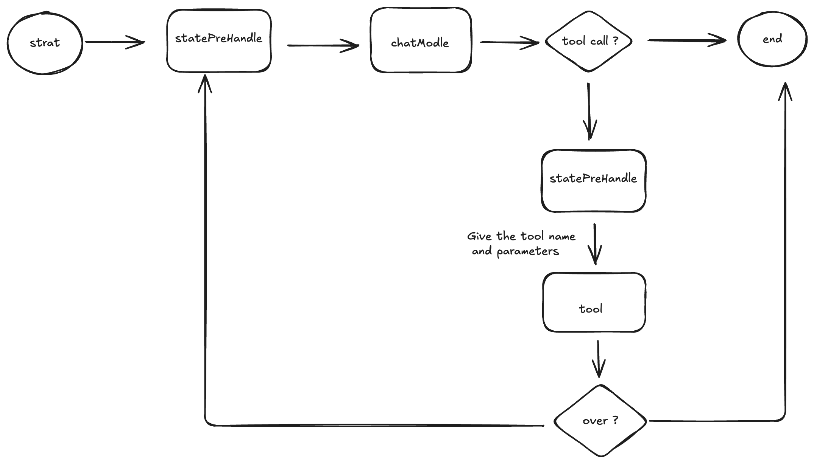
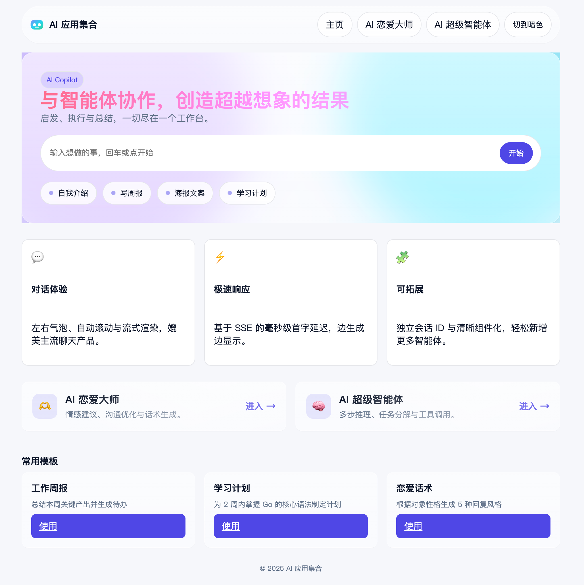
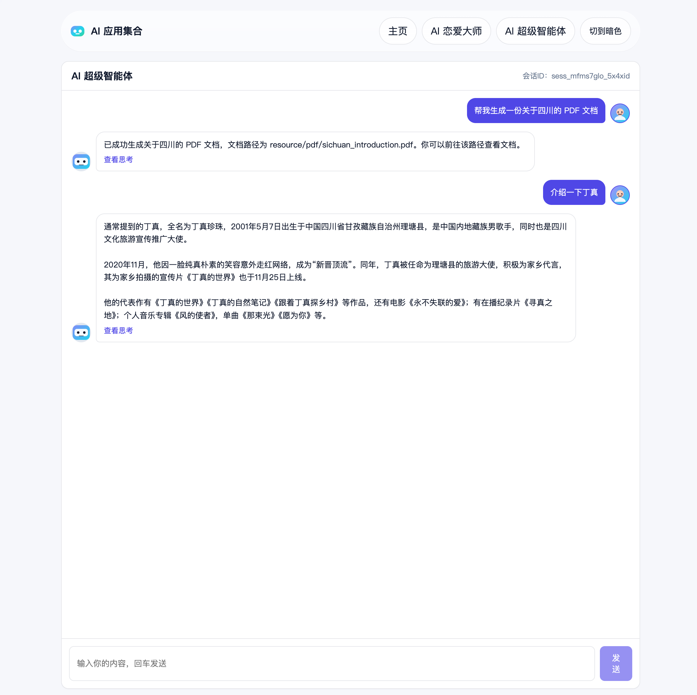
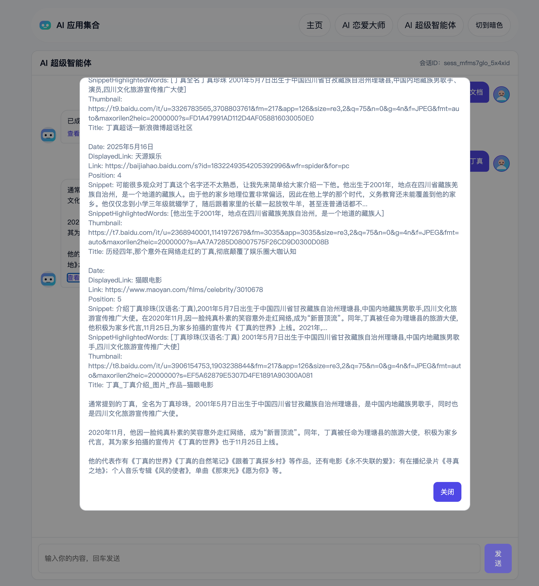
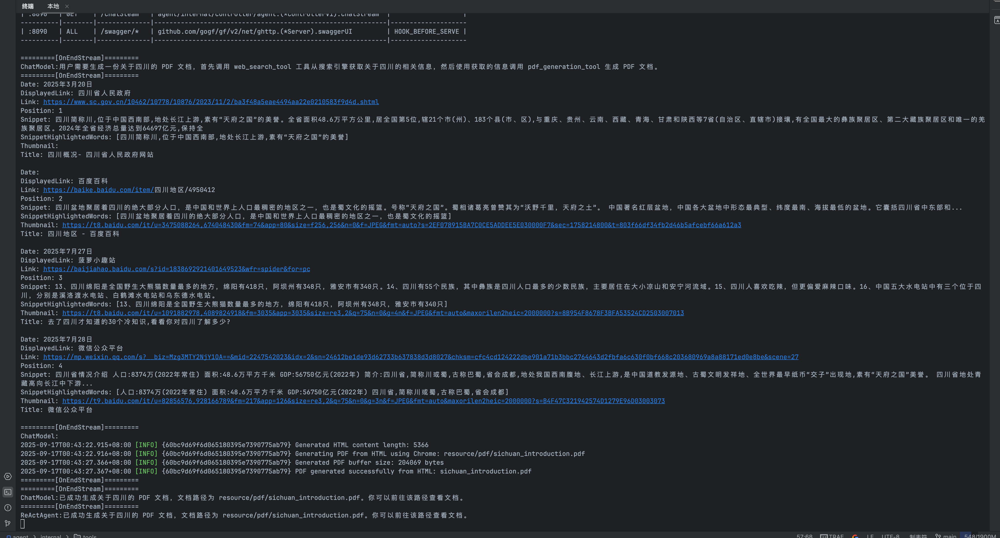
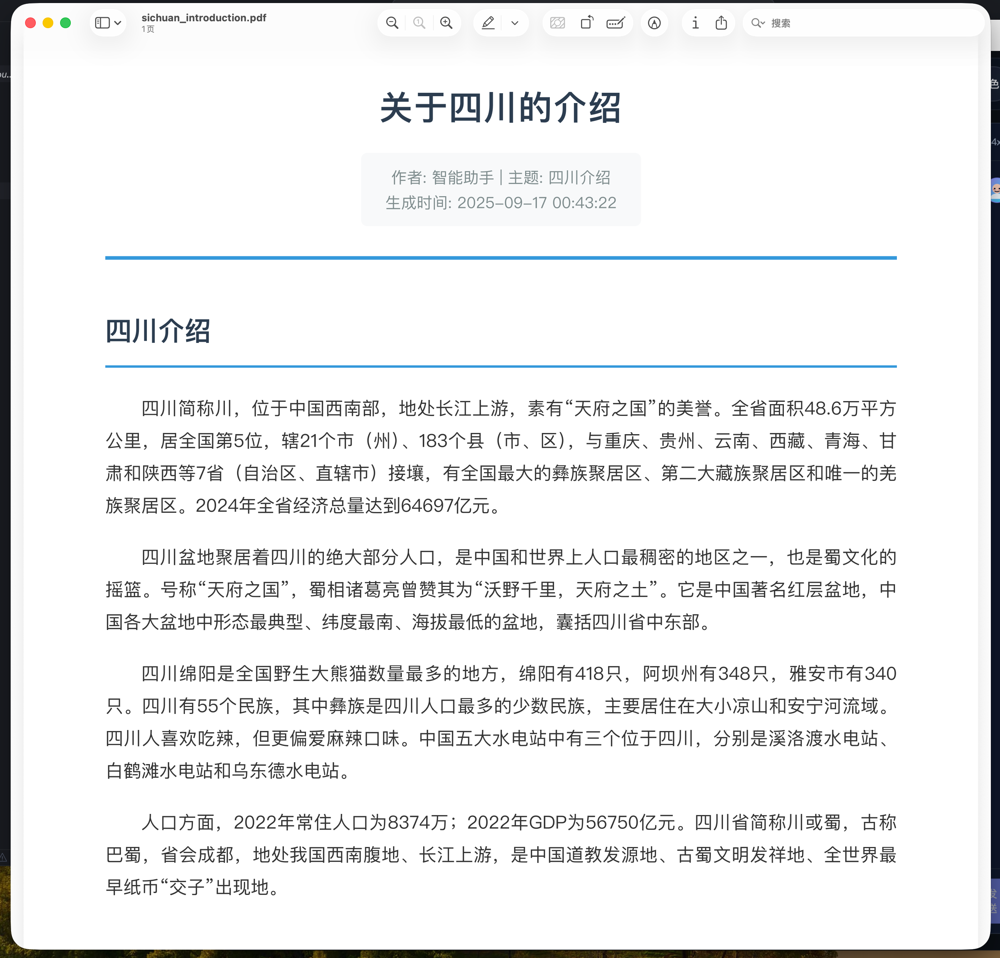

## Agent架构


### 说明
前后端分离项目
前端:
1. Vue3 项目
2. Axios 请求库
后端
1. GoFrame 框架
2. Eino 框架

# 运行流程

## 1. 下载项目
```bash
git clone https://github.com/ipvoov/Agent-go.git
```

## 2. 安装 milvus 向量知识库
```bash
docker-compose up -d
```

## 3. 修改配置文件

修改manifest/config/config.yaml中的apiKey 和你想使用的模型
想要使用搜索和地图工具,要修改 api

## 4. 启动项目

在项目根目录下执行：
```bash
go run main.go
```

如果你需要自动编译，可以执行：
```bash
gf run main.go
```

## 5.前端运行流程
```bash
cd /agent-frontend && npm i && npm run dev
```

## 2.前端
## 2.1 前端展示


## 2.2 Ai思考过程
### 2.2.1 对话框
<div style="display: flex; justify-content: space-around; flex-wrap: wrap;">


</div>

### 2.2.2 Ai思考过程与调用tool过程与生成的PDF
<div style="display: flex; justify-content: space-around; flex-wrap: wrap;">


</div>


